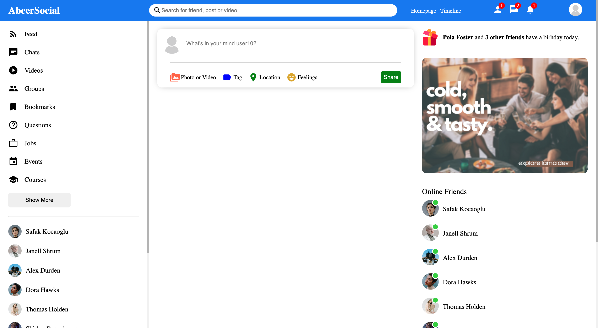
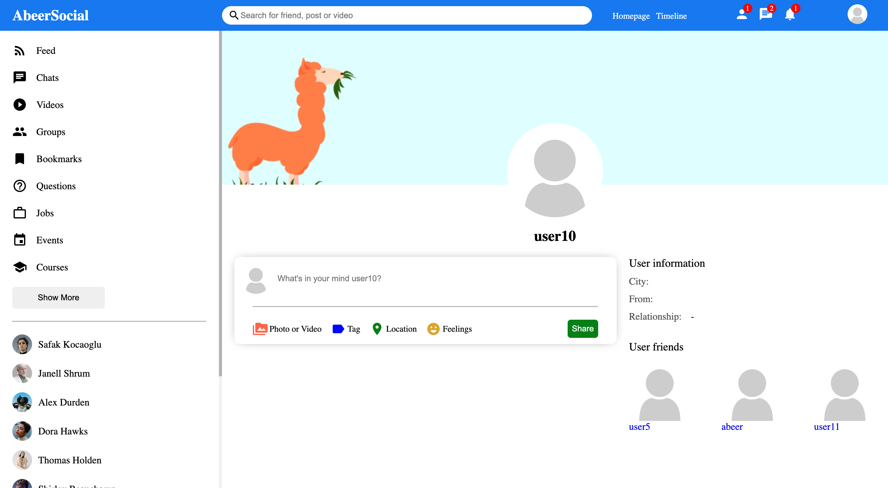
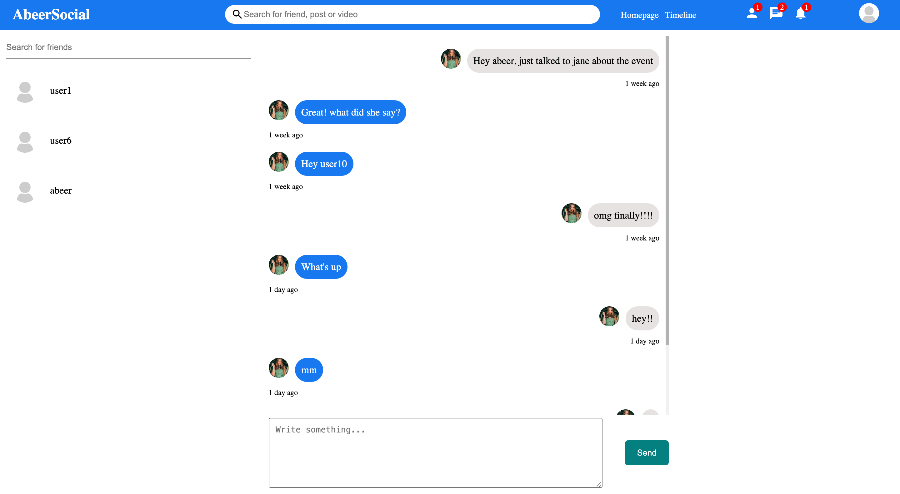

# Social Media App Real-Time Chat

## Table of Contents
- [General Information](#general-information)
- [Technologies Used](#technologies-used)
- [Features](#features)
- [Screenshots](#screenshots)
- [Installation and Setup Instructions](#installation-and-setup-instructions)
- [Usage](#usage)
- [Project Status](#project-status)
- [Room for Improvement](#room-for-improvement)
- [Acknowledgements](#acknowledgements)
- [Contact](#contact)

## General Information
The Social Media App is a comprehensive platform that enables users to connect, share updates, and engage with others in a social networking environment. Built with a full-stack approach, the application incorporates features such as user registration, login, posting, following/unfollowing, and real-time messaging using Socket.IO. The technology stack includes ReactJS, Node.js, MongoDB, Express, and Socket.IO.

### Purpose of this Project
The primary goal of this project is to showcase proficiency in full-stack development by creating a feature-rich social media application.

## Technologies Used
- ReactJS
- Node.js
- Express
- MongoDB
- Socket.IO
- Axios
- React Router
- Bootstrap
- JavaScript
- HTML
- CSS
- Bcrypt

## Features
- User registration and login
- Posting and sharing updates
- Following and unfollowing users
- Real-time messaging using Socket.IO
- Personalized user profiles
- Seamless navigation with React Router
- Responsive design with Bootstrap
- Secure authentication with Bcrypt

## Screenshots

*Home Feed*

*User Profile*

*Messaging Interface*

## Installation and Setup Instructions
To set up the Social Media App on your local machine, follow these steps:

1. Clone this repository.
2. Ensure Node.js and npm are installed on your system.
3. Install server dependencies: `cd server && npm install`
4. Install client dependencies: `cd client && npm install`
5. Start the server: `cd server && npm start`
6. Start the client: `cd client && npm start`
7. Visit the app at `http://localhost:3000/`

## Usage
### User Registration and Login
- Users can register for a new account or log in using their credentials.

### Posting and Following
- Share updates and follow/unfollow other users to personalize your home feed.

### Real-time Messaging
- Engage in real-time conversations with other users using the integrated messaging system.

### Profile Pages
- Users have dedicated profile pages where they can manage posts, followers, and update their information.

## Project Status
The Social Media App is currently in a completed state.

## Room for Improvement
- Implement additional features like image uploads and multimedia sharing.
- Enhance the messaging system with multimedia support.

## Acknowledgements
Special thanks to the developer communities for React, Node.js, and Socket.IO.

## Contact
Created by [Abeer Ahmed] - [LinkedIn Profile](https://www.linkedin.com/in/abeerwebdev/) - Feel free to contact me for any inquiries or feedback.
